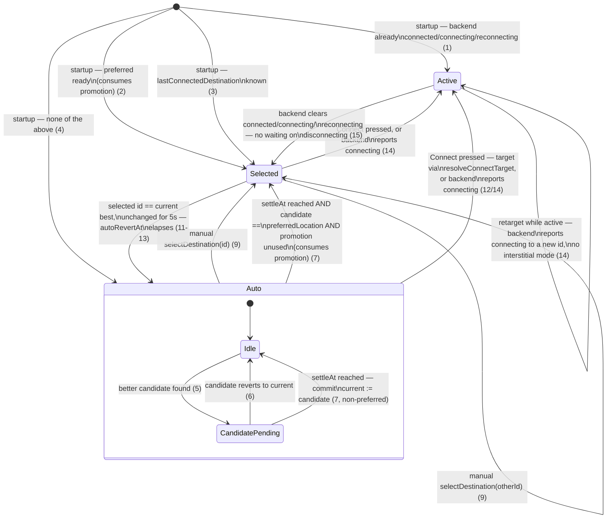

# Main-screen destination mode

The main screen's "which destination is shown/targeted" behavior is modeled in
`appStore` as three mutually-exclusive modes: `auto`, `selected`, and `active`.
This document is the reviewable state diagram for that model, written before any
implementation — see the transition table it summarizes for the exact rules
(numbers below match that table).

## States

- **`auto`** — no destination explicitly chosen. Internally tracks `current`
  (the presently-shown pick) and an optional `pending` candidate mid-switch.
  Never promotes itself out except via the one-time preferred-location rule.
- **`selected: { id }`** — a specific destination is chosen. No auto
  re-targeting, except reverting back to `auto` if `id` happens to coincide with
  auto's current best pick for a sustained 5s.
- **`active: { id }`** — connecting, connected, or reconnecting to `id`.
  Excludes `disconnecting`: the instant nothing is connecting/connected/
  reconnecting, mode is already `selected`, regardless of backend teardown still
  in flight.

## Transition table

### Startup

On `initializeApp`, once the first destinations batch arrives:

1. Backend already reports `connected`/`connecting`/`reconnecting` →
   `active(id)` (reopening mid-connection wins outright).

2. Else `settings.preferredLocation` is set and is ready-to-connect →
   `selected(preferredId)`, and this **immediately consumes**
   `preferredPromotionUsed` (it's the same "preferred is available" condition as
   rules 5-7 below, just satisfied at the first possible moment instead of via a
   later edge-triggered commit — either path fires it exactly once).

3. Else `settings.lastConnectedDestination` is a known destination →
   `selected(id)`.

4. Else → `auto`, with `current` set immediately (no countdown) to
   `resolveAutoDestination(...)`'s pick — only _changes_ to the pick go through
   the countdown/settle sequence below, not the first-ever value.

### Inside `auto`

Reactive to `availableDestinations`/`destinations`/`preferredLocation` changes:

5. `resolveAutoDestination` returns an id different from `current` and different
   from an existing `pending.candidateId` → set
   `pending = { candidateId, settleAt: now + SWITCH_COUNTDOWN_MS + SWITCH_CROSSOVER_MS }`.

6. The winning candidate reverts back to equal `current` before `settleAt` →
   clear `pending`.

7. At `settleAt` → commit `current := candidateId`, clear `pending`.
   - If `candidateId === settings.preferredLocation` and
     `!preferredPromotionUsed` → **also** transition to `selected(candidateId)`
     and set `preferredPromotionUsed = true`. This is the same one-time
     promotion as startup rule 2, just reached later via the edge-triggered
     watch instead of at the first possible moment — whichever path satisfies it
     first consumes the flag; the other never fires afterward, even if preferred
     flips unready→ready again later in the run.

8. This loop repeats indefinitely while in `auto` — it never exits itself except
   via rule 7's promotion.

### Manual selection

9. `selectDestination(id)` while in `auto` or `selected(other)` →
   `selected(id)`, clearing any pending/auto-revert state. (No special case
   needed for "id happens to equal auto's current best" — rule 11 below handles
   that uniformly afterward.)

10. `selectDestination(id)` while `active` → no-op (retargeting while active
    goes through rule 14, not this action).

### `selected` auto-revert

The one auto-behavior allowed in this mode:

11. Whenever mode is `selected(id)` and `id` currently equals
    `resolveAutoDestination`'s pick, start
    `autoRevertAt = now + SWITCH_COUNTDOWN_MS` if not already running.

12. If `id` stops matching the best pick before `autoRevertAt` → clear
    `autoRevertAt`, stay `selected(id)` indefinitely (sticky).

13. At `autoRevertAt` → revert to `auto` with `current = id`, `pending = null`.

### Connecting/disconnecting

14. Backend reports `connected`/`connecting`/`reconnecting` for some id (from
    any prior mode, or retargeting an already-`active` id) → mode is
    `active(id)`, mirroring that id live.

15. Backend reports none of those (regardless of whether `disconnecting` is
    still non-empty — **no waiting, no special "disconnecting" mode**) →
    `selected(id)` where `id` is whatever was last `active`.

### Resolving what Connect should target

Pure function, no store mutation — `resolveConnectTarget(mode, now)`:

- `selected(id)` → `id`
- `active(id)` → `id`
- `auto` with no `pending`, or `now < pending.settleAt` → `current`
- `auto` with `pending` and `now >= pending.settleAt` → `pending.candidateId`

## Constants

- `SWITCH_COUNTDOWN_MS = 5_000` — how long a better candidate is "pending"
  before it takes effect.
- `SWITCH_ANIMATE_MS = 1_000` — total duration of the (UI-owned) slide animation
  once a switch starts.
- `SWITCH_CROSSOVER_MS = 500` — offset within the animation window at which the
  new candidate becomes the resolved target (tunable later; not derived from
  DOM/pixels).
- A module-level `preferredPromotionUsed` flag (not part of `AppState`, not
  reset by `criticalError` — only by an actual app restart).

## Non-goal for this phase

No changes to `bannerStore.ts`, `LocationBanner.tsx`, `ConnectButton.tsx`, or
`ExitNodeList.tsx` yet. Those currently implement an overlapping, ad hoc version
of this same logic and will be wired up to consume `appStore`'s `mode` — with
their duplicate logic retired — in a later pass.
