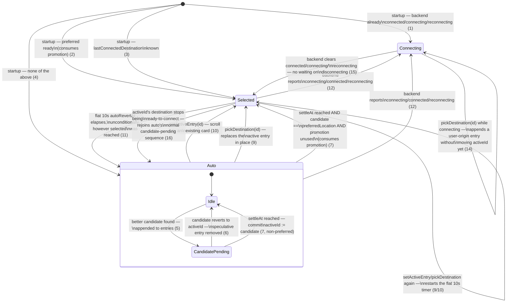

# Main-screen destination mode

The main screen's "which destination is shown/targeted" behavior is modeled in
`appStore` as a single list-based model, `DestinationModel`, defined in
`src/stores/destinationMode.ts`. The history banner's list _is_ the model — an
ordered, partly auto-populated and partly user-populated list of destinations
(`entries`), with exactly one `activeId` pointing at the member that
Connect/Disconnect would act on. A `phase` — `auto`, `selected`, or `connecting`
— governs how `entries`/`activeId` evolve. This document is the reviewable state
diagram for that model; the transition table below is the source of truth
(numbers match rule numbers used in code comments).



## Data model

```ts
type DestinationOrigin = "auto" | "user";

interface DestinationEntry {
  id: string;
  origin: DestinationOrigin;
}

interface AutoPending {
  candidateId: string;
  countdownEndsAt: number; // now + SWITCH_COUNTDOWN_MS
  settleAt: number; // countdownEndsAt + SWITCH_CROSSOVER_MS
}

type DestinationModel =
  | { phase: "uninitialized" }
  | {
    phase: "auto";
    entries: DestinationEntry[];
    activeId: string;
    pending: AutoPending | null;
  }
  | {
    phase: "selected";
    entries: DestinationEntry[];
    activeId: string;
    autoRevertAt: number;
  }
  | { phase: "connecting"; entries: DestinationEntry[]; activeId: string };
```

Each phase carries only the fields meaningful to it, instead of one flat shape
full of "only meaningful when ..." nullables. `activeId` is never `null` past
`uninitialized`, and `autoRevertAt` is never `null` while `selected` — every
entry into that phase, however reached, always starts the same flat 10s timer,
so the type never allows constructing one without a deadline attached. The one
fact that's genuinely optional is whether `auto` currently has a pending
candidate.

`entries` is session-only history: oldest first, newest/current last (except
when a `selected`-phase pick replaces an entry in place — see rule 9). An
entry's `origin` records whether it was auto-appended or user-picked; nothing
currently prunes old entries besides an auto candidate that reverts before it
ever settles (rule 6).

## States

- **`uninitialized`** — before the first destinations batch (with ≥1
  ready-to-connect) has arrived. No `entries`/`activeId` yet.
- **`auto`** — no destination explicitly chosen. Tracks `entries`/`activeId`
  plus an optional `pending` candidate mid-switch. Never promotes itself out
  except via the one-time preferred-location rule (7).
- **`selected`** — a specific entry is active (a manual pick, a scroll to an
  existing card, or a startup/promotion landing). Always carries `autoRevertAt`:
  a flat, unconditional 10s deadline back to `auto`, regardless of how
  `selected` was reached.
- **`connecting`** — connecting, connected, or reconnecting to `activeId`.
  Excludes `disconnecting`: the instant nothing is connecting/connected/
  reconnecting, phase is already `selected`, regardless of backend teardown
  still in flight.

## Actions

- **`setActiveEntry(id)`** — scrolling the banner to a card already in
  `entries`. A no-op for unknown ids and while `connecting` (a live connection
  is only ever retargeted through a real `connect()` call, reflected back via
  rule 12, not this action).
- **`pickDestination(id)`** — picking a destination from the vertical
  ExitNodeList. Works for any known destination, not just one already in the
  banner; its effect depends on the current phase (rules 9 & 14 below).

## Transition table

### Startup

On `initializeApp`, once the first destinations batch arrives:

1. Backend already reports `connected`/`connecting`/`reconnecting` →
   `connecting`, `entries = [{id, origin: "auto"}]`, `activeId = id` (reopening
   mid-connection wins outright).

2. Else `settings.preferredLocation` is set and is ready-to-connect →
   `selected`, single entry, and this **immediately consumes**
   `preferredPromotionUsed` (it's the same "preferred is available" condition as
   rules 5-7 below, just satisfied at the first possible moment instead of via a
   later edge-triggered commit — either path fires it exactly once).

3. Else `settings.lastConnectedDestination` is a known destination → `selected`,
   single entry.

4. Else → `auto`, single entry set immediately (no countdown) to
   `resolveAutoDestination(...)`'s pick — only _changes_ to the pick go through
   the countdown/settle sequence below, not the first-ever value.

Every `selected` landing above (2 and 3) starts the same flat 10s `autoRevertAt`
timer as any other path into `selected` — see rule 11.

### Inside `auto`

Reactive to `availableDestinations`/`destinations`/`preferredLocation` changes:

5. `resolveAutoDestination` returns an id different from `activeId` and
   different from an existing `pending.candidateId` → append
   `{id: candidateId, origin: "auto"}` to `entries` immediately, and set
   `pending = { candidateId, settleAt: now + SWITCH_COUNTDOWN_MS + SWITCH_CROSSOVER_MS }`.
   A different candidate superseding an earlier, not-yet-settled one drops that
   earlier speculative entry rather than leaving it stranded.

6. The winning candidate reverts back to equal `activeId` before `settleAt` →
   remove the speculative entry just appended, clear `pending`.

7. At `settleAt` → commit `activeId := candidateId`, clear `pending`.
   - If `candidateId === settings.preferredLocation` and
     `!preferredPromotionUsed` → **also** transition to `selected(candidateId)`
     (with the flat 10s revert timer) and set `preferredPromotionUsed = true`.
     This is the same one-time promotion as startup rule 2, just reached later
     via the edge-triggered watch instead of at the first possible moment —
     whichever path satisfies it first consumes the flag; the other never fires
     afterward, even if preferred flips unready→ready again later in the run.

8. This loop repeats indefinitely while in `auto` — it never exits itself except
   via rule 7's promotion. The active entry going not-ready is just another
   "different id returned" case for rule 5, with no special-case code:
   `resolveAutoDestination` simply stops returning it.

### Manual selection

9. `pickDestination(id)`:
   - While `auto` or `selected` → replaces the _active_ entry's `id` in place
     (same slot, `entries.length` unchanged), tags it `origin: "user"`, and
     enters `selected` with a fresh flat 10s `autoRevertAt`. Any not-yet-settled
     auto candidate is discarded first (see rule 5's note) rather than left
     stranded.
   - While `connecting` → see rule 14.

10. `setActiveEntry(id)`, `id` already in `entries`:
    - While `auto` or `selected` → `activeId := id`, enters `selected` with a
      fresh flat 10s `autoRevertAt`. If `id` is a not-yet-settled auto
      candidate, it's promoted immediately (short-circuiting the countdown);
      otherwise any _other_ not-yet-settled candidate is discarded.
    - While `connecting` → no-op (see rule 13).
    - Unknown `id` → no-op.

11. At `autoRevertAt` → revert to `auto`, `pending = null`, `entries`/
    `activeId` unchanged — unconditionally, regardless of how `selected` was
    reached or whether `activeId` still matches `resolveAutoDestination`'s pick.
    A fresh pick/scroll while already `selected` cancels the previous timer and
    restarts it.

### Unavailable non-auto entry

16. While `selected`, if `activeId`'s destination stops being ready-to-connect →
    drop back to `auto` (`pending = null`); the effect behind rules 5-8 then
    runs immediately (same reactive flush) and starts its normal
    candidate-pending sequence toward the best remaining destination. Skipped
    for ids we have no data for at all (an unconfirmed pick isn't the same as a
    known-unavailable one).

### Connecting/disconnecting

12. Backend reports `connected`/`connecting`/`reconnecting` for some id (from
    any prior phase, or retargeting an already-`connecting` id) → phase is
    `connecting`, `activeId := id`; append `{id, origin: "auto"}` to `entries`
    if not already present.

13. `setActiveEntry(id)` while `connecting` → no-op. Retargeting a live
    connection by scrolling goes through a real `connect()` call issued by the
    caller (not modeled in this store) and is only reflected back once the
    backend confirms, via rule 12.

14. `pickDestination(id)` while `connecting` → append `{id, origin: "user"}` to
    `entries` without moving `activeId` yet; the caller issues the actual
    `connect()`, and `activeId` only moves once the backend confirms (rule 12) —
    no duplicate entry is created when it does.

15. Backend reports none of connected/connecting/reconnecting (regardless of
    whether `disconnecting` is still non-empty — **no waiting, no special
    "disconnecting" phase**) → `selected`, `activeId :=` whatever was last
    `connecting`, with the same flat 10s `autoRevertAt`.

### Resolving what Connect should target

Pure function, no store mutation — `resolveConnectTarget(model, now)`:

- `uninitialized` → `null`
- `selected(activeId)` / `connecting(activeId)` → `activeId`
- `auto` with no `pending`, or `now < pending.settleAt` → `activeId`
- `auto` with `pending` and `now >= pending.settleAt` → `pending.candidateId`

`currentDisplayId(model)` is the same, minus the pending-lookahead: `null` while
`uninitialized`, otherwise `activeId`.

## Constants

- `SWITCH_COUNTDOWN_MS = 5_000` — how long a better candidate is "pending"
  before it takes effect.
- `SELECTED_AUTO_REVERT_MS = 10_000` — the flat, unconditional deadline for any
  `selected`-phase entry to revert to `auto` (rule 11), regardless of how it was
  reached.
- `SWITCH_ANIMATE_MS = 1_000` — total duration of the (UI-owned) slide animation
  once a switch starts.
- `SWITCH_CROSSOVER_MS = 500` — offset within the animation window at which the
  new candidate becomes the resolved target (tunable later; not derived from
  DOM/pixels).
- A module-level `preferredPromotionUsed` flag (not part of the exposed model,
  not reset by `criticalError` — only by an actual app restart).

## Non-goal for this phase

This pass only changed the data model (`destinationMode.ts`) and the minimal
call-site updates needed for `appStore.ts`, `ExitNodeList.tsx`, and
`LocationBanner.tsx` to keep compiling against the new shape. None of the
following were redesigned, and remain candidates for a later UI pass:

- `LocationBanner.tsx` doesn't yet implement "scroll to a card re-points
  `activeId`" (rule 10) or "scroll while connecting retargets the connection"
  (rule 13) — scrolling is currently just a drag/tap-to-open gesture with no
  `setActiveEntry`/`connect()` wiring.
- Its slide-vs-jump animation choice is a placeholder derived from the newest
  entry's `origin` (`"auto"` → slide, `"user"` → jump), which is only an
  approximation of "was this specific transition auto-driven or user-driven" —
  accurate in the common cases, but not exhaustively.
